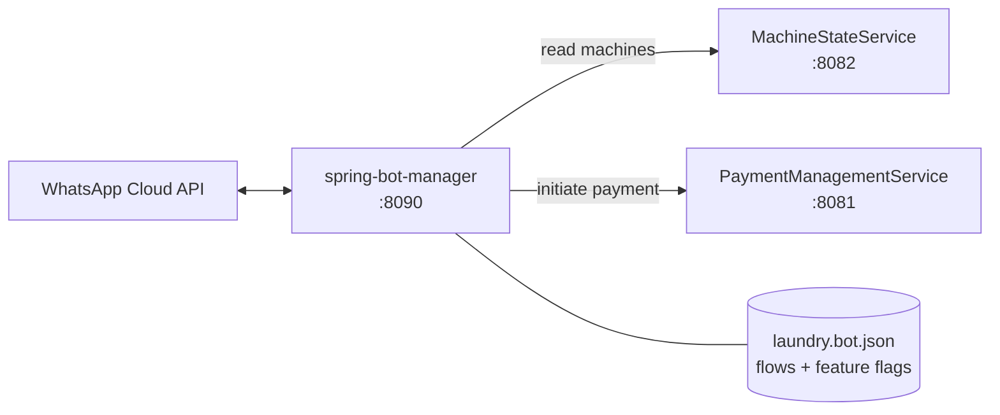
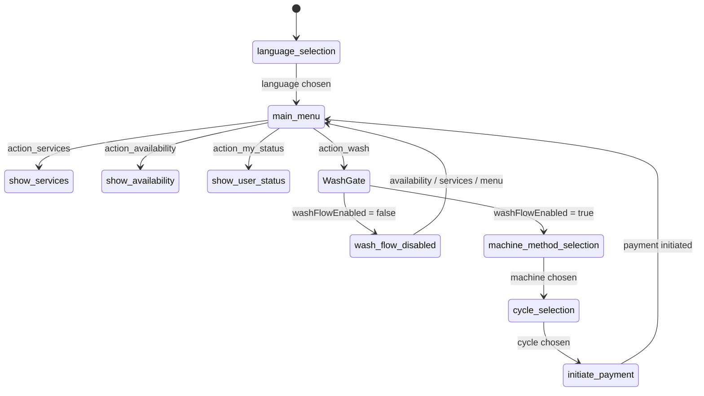
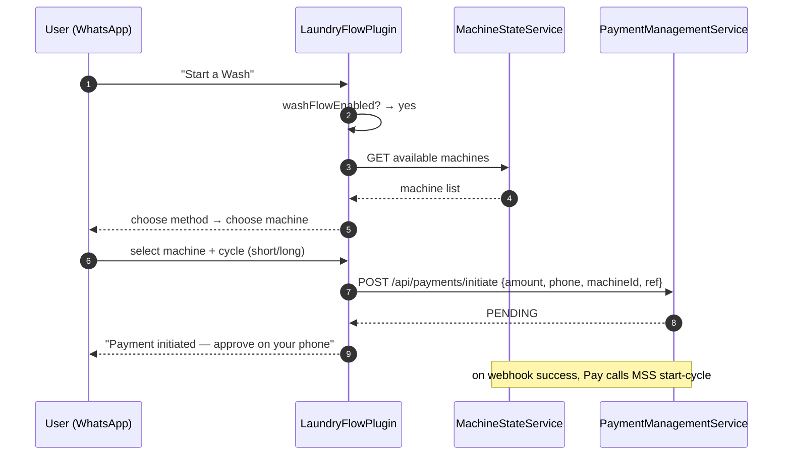
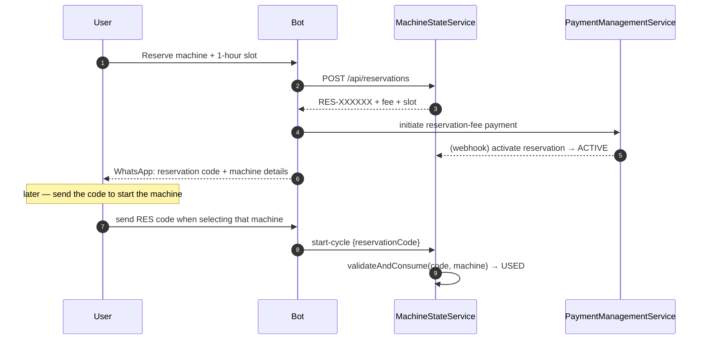

# spring-bot-manager — Communication Flow

Port **8090** · branch `develop` · multi-module Maven (bot-core, bot-laundry, bot-payment,
bot-pharmacy, bot-app)

The bot is the **WhatsApp conversational front end**. It drives a state-machine flow
(`laundry.bot.json`), reads machine availability from MachineStateService, and initiates
payments through PaymentManagementService. Two feature flags gate behaviour.

---

## 1. System context

### Feature flags (`configs/bots/laundry.bot.json` → `features`)

| Flag | Default | Effect when **false** |
|------|---------|-----------------------|
| `washFlowEnabled` | `false` | Users can only check availability/info. Machine-select → cycle-select → payment is blocked. |
| `reservationEnabled` | `false` | Reservation entry point hidden. |

The wash-flow flag is enforced **in the bot** (`LaundryFlowPlugin`); the reservation
mechanism itself lives in MachineStateService.

---

## 2. Conversation state machine

When `washFlowEnabled` is false, `handleStartWashFlow` short-circuits to
`handleWashFlowDisabled` — an info message (`wash_flow_disabled`, EN/FR) offering only
availability, services, and the main menu. No machine, cycle, or payment path is reachable.

---

## 3. Happy-path wash sequence (flag ON)

When `washFlowEnabled` is **false** the same "Start a Wash" tap is intercepted at the gate
and never reaches MachineStateService or PaymentManagementService for a start.

---

## 4. Reservation (flag ON, mechanism in MachineStateService)

Authorization is by **code + machine, not by user** — anyone holding the code for that
machine can start it within the slot.

---

## 5. Configuration sync

- Highest wash cycle = `longCycle.price` (2000 XAF) → this is the reservation fee in
  MachineStateService (`reservation.fee-amount`). Keep the two in sync.
- Slot length is fixed at **exactly 1 hour** (not configurable).
- Translations (`wash_flow_disabled`, etc.) live in `bot-core` `TranslationService`
  (EN/FR via `addTranslation`).
